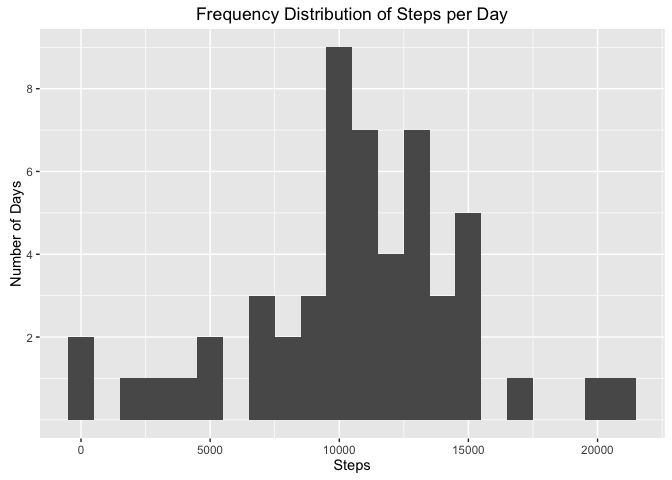
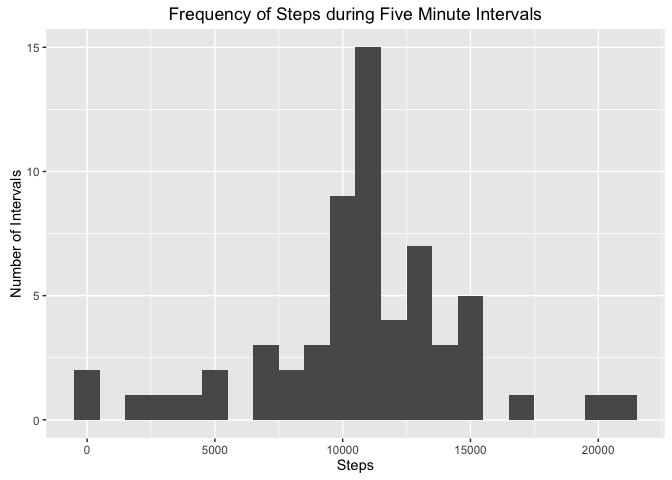
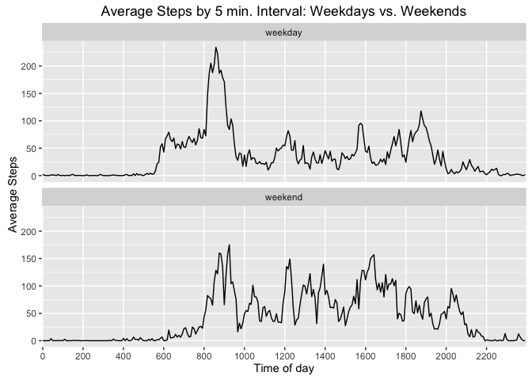

# Reproducible Research: Peer Assessment 1
### Patrick Conroy, Jr.

## Loading and preprocessing the data

I retrieved the data from the project repository, which was forked from https://github.com/rdpeng/RepData_PeerAssessment1, commit: 80edf39c3bb508fee88e3394542f967dd3fd3270 on July 26, 2016. The data is stored compressed in "activity.zip". That file is unzipped and read into a data.frame. Then the dates, which were read as factors, are convered to type Date.


```r
unzip("activity.zip")
df <- read.csv("activity.csv", header = TRUE)
df$date <- as.Date(as.character(df$date))
```

Note that the "interval" is represented as an integer in the form hhmm. This is strange, because plotting the intervals as integers would throw off the scaling of that axis (Think missing data points between 155 and 200). Let's change interval to an ordered factor instead. Plus, I learn something.


```r
# the easiest way to get the levels is to take advantage of the ordering
# already in the data.
levels <- df$interval[1:288]
df$interval <- factor(df$interval, levels = levels, ordered = TRUE)
```
## What is mean total number of steps taken per day?

Using dplyr for this part, because it is awesome. We create steps.by.day, a dataframe where the first column is the date, and the second is the corresponding total number of steps on that date.


```r
library(dplyr, quietly = TRUE)

steps.by.day <- df %>%
                group_by(date) %>%
                summarize(steps = sum(steps))
```

1. Make a histogram of the total number of steps taken each day 

```r
library(ggplot2) # using ggplot2, because it is pretty and I need the practice.

# filtering out where steps is NA. It doesn't change the mean, median, or histogram,
# and it supresses a warning from qplot about rows containing non-finite values

qplot(filter(steps.by.day, !is.na(steps))$steps,
      geom = "histogram", binwidth = 1000, main = "Freq. of Steps/Day") +
        labs(x="Steps", y="Number of Days") +
        ggtitle("Frequency Distribution of Steps per Day") +
        scale_y_continuous(breaks = c(2,4,6,8,10))
```

<!-- -->

2. Calculate and report the mean and median total number of steps taken per day

```r
mean(steps.by.day$steps, na.rm = TRUE)
```

```
## [1] 10766.19
```

```r
median(steps.by.day$steps, na.rm = TRUE)
```

```
## [1] 10765
```


## What is the average daily activity pattern?

1. Make a time series plot (i.e. type = "l") of the 5-minute interval (x-axis) and the average number of steps taken, averaged across all days (y-axis)


```r
steps.by.interval <- df %>%
                group_by(interval) %>%
                summarize(steps = mean(steps, na.rm = TRUE))

breaks <- levels[seq(1, length(levels), 24)] # setting up the tick marks for the x-axis

ggplot(data = steps.by.interval, aes(x=interval, y=steps)) +
    geom_line(aes(group = 1)) +
    labs(x="Time of Day", y = "Steps") +
    ggtitle("Time Series of Mean Steps per Interval") +
    scale_x_discrete(breaks = breaks)
```

<!-- -->

2. Which 5-minute interval, on average across all the days in the dataset, contains the maximum number of steps?


```r
steps.by.interval$interval[which.max(steps.by.interval$steps)]
```

```
## [1] 835
## 288 Levels: 0 < 5 < 10 < 15 < 20 < 25 < 30 < 35 < 40 < 45 < 50 < ... < 2355
```

## Imputing missing values

1. Calculate and report the total number of missing values in the dataset (i.e. the total number of rows with NAs)

As we see, there are NAs in the data set, and they are all in the variable 'steps'.


```r
sum(!complete.cases(df))
```

```
## [1] 2304
```

```r
sum(is.na(df$steps))
```

```
## [1] 2304
```

2. Devise a strategy for filling in all of the missing values in the dataset. The strategy does not need to be sophisticated. For example, you could use the mean/median for that day, or the mean for that 5-minute interval, etc.

Not getting fancy here, I'll just fill in the NA's with the mean of that 5-minute interval across all days. I considered using the mean of that day, but some days have no step values at all, so there is nothing to use to calculate a mean. The code to fill in the missing data is in the next item (3).

3. Create a new dataset that is equal to the original dataset but with the missing data filled in.


```r
filled <- cbind(df, steps.by.interval$steps)
names(filled)[4] = "interval.mean"
filled$steps <- apply(filled, 1, function(x){ifelse(is.na(x[1]),x[4],x[1])})
filled$steps <- as.double(filled$steps) # these were character. No bueno.
```

4. Make a histogram of the total number of steps taken each day and Calculate and report the mean and median total number of steps taken per day. Do these values differ from the estimates from the first part of the assignment? What is the impact of imputing missing data on the estimates of the total daily number of steps?


```r
spd <- filled %>%
        group_by(date) %>%
        summarize(steps=sum(steps))
qplot(steps, data=spd, geom="histogram", binwidth = 1000) +
    labs(x = "Steps", y = "Number of Intervals") +
    ggtitle("Frequency of Steps during Five Minute Intervals")
```

<!-- -->

```r
mean(spd$steps)
```

```
## [1] 10766.19
```

```r
median(spd$steps)
```

```
## [1] 10766.19
```
The mean and median do not differ much at all from the earlier findings. This appears to be because the NAs in the step counts were all of the readings on eight entire days, and there were no NAs on other days. The method of interpolating missing data that I chose just increased the number of "average" days, but didn't change either the mean or the median. There was, however, a change in the histogram.


## Are there differences in activity patterns between weekdays and weekends?

1. Create a new factor variable in the dataset with two levels -- "weekday" and "weekend" indicating whether a given date is a weekday or weekend day.


```r
wkend <- c("Sunday", "Saturday")
days <- mutate(df, daytype = as.factor(ifelse(weekdays(date) %in% wkend,
                                              "weekend", "weekday")))
```

2. Make a panel plot containing a time series plot (i.e. type = "l") of the 5-minute interval (x-axis) and the average number of steps taken, averaged across all weekday days or weekend days (y-axis).


```r
dayssum <- days %>%
            group_by(daytype, interval) %>%
            summarise(avg.steps = mean(steps, na.rm = TRUE))

ggplot(data = dayssum, aes(x = interval, y = avg.steps)) +
    geom_line(aes(group = 1)) +
    facet_wrap(~daytype, nrow = 2) +
    ggtitle("Average Steps by 5 min. Interval: Weekdays vs. Weekends") +
    labs(x = "Time of day", y = "Average Steps") +
    scale_x_discrete(breaks = breaks)
```

<!-- -->
